  <!-- Typing SVG Banner -->
  

  

    
    
  

---

### 🌌 Mi Ecosistema Cósmico (GitHub Orbit)

  <em>Mapeo astronómico generado dinámicamente con las órbitas, constelaciones y actividad de mis repositorios.</em>

  

  Impulsado por <a href="https://github.com/NiconiKimg/github-profile-orbit">github-profile-orbit</a> vía GitHub Actions.

---

### 🛠️ Tecnologías & Herramientas

  <!-- Lenguajes -->
  

    
    
    
    
    
  

  <!-- Herramientas & DevOps -->
  

    
    
    
    
  

---

### 🐍 Snake Game (Historial de Contribuciones)

  <em>La serpiente retro devorando los commits y contribuciones a lo largo del año.</em>

  <picture>
    <source media="(prefers-color-scheme: dark)" srcset="https://raw.githubusercontent.com/Frasquito3/Frasquito3/output/github-snake-dark.svg" />
    <source media="(prefers-color-scheme: light)" srcset="https://raw.githubusercontent.com/Frasquito3/Frasquito3/output/github-snake.svg" />
    
  </picture>

  Generado automáticamente con <a href="https://github.com/Platane/snk">Platane/snk</a> cada 24 horas.

---

### 📊 Métricas & Estadísticas de GitHub

  <table border="0">
    <tr>
      <td align="center">
        
      </td>
      <td align="center">
        
      </td>
    </tr>
    <tr>
      <td colspan="2" align="center">
        
      </td>
    </tr>
  </table>

---

### 📬 Conectemos

  
  

 

  ⭐ Diseñado con pasión cósmica para GitHub.

